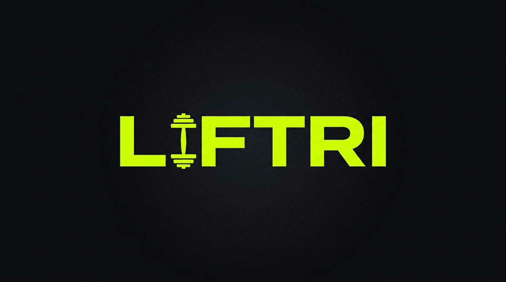

# 🏋️ Liftri

> **Fitness tracking PWA** — Crea rutinas, registra entrenamientos, rompe récords.



[](https://reactjs.org/)
[](https://www.typescriptlang.org/)
[](https://supabase.com/)
[](https://vitejs.dev/)
[](https://web.dev/progressive-web-apps/)

---

## ✨ Características

| Feature | Descripción |
|---|---|
| 🔐 **Autenticación** | Registro e inicio de sesión con Supabase Auth |
| 📋 **Rutinas** | Crea y edita rutinas multi-día con ejercicios específicos |
| 💪 **Workout Logger** | Registra sets, reps y peso en tiempo real |
| 🏆 **Récords personales** | Tracking automático de PRs por ejercicio |
| 📊 **Dashboard** | Métricas de sesiones, volumen total y progreso |
| 📚 **Biblioteca** | Catálogo de ejercicios por grupo muscular |
| ⏱️ **Timer de descanso** | Timer configurable entre sets (60/90/120s) |
| 📅 **Rutinas programadas** | Asigna rutinas a días de la semana |
| ⚙️ **Ajustes** | Unidades de peso (kg / lb) persistidas localmente |
| 📱 **PWA** | Instalable en Android/iOS, funciona offline |

---

## 🛠️ Tech Stack

```
Frontend:  React 18 + TypeScript + Vite
Backend:   Supabase (PostgreSQL + Auth + RLS)
Styling:   Vanilla CSS (design system propio)
PWA:       vite-plugin-pwa + Workbox
```

**Sin backend propio** — toda la lógica corre en el cliente usando el SDK de Supabase directamente.

---

## 🚀 Instalación y configuración

### Prerrequisitos

- Node.js ≥ 18
- Una cuenta y proyecto en [Supabase](https://supabase.com/)

### 1. Clonar el repositorio

```bash
git clone https://github.com/diques1982/liftri.git
cd liftri
```

### 2. Instalar dependencias

```bash
npm install
```

### 3. Configurar variables de entorno

Crea un archivo `.env` en la raíz del proyecto:

```env
VITE_SUPABASE_URL=https://tu-proyecto.supabase.co
VITE_SUPABASE_ANON_KEY=tu-anon-key-publica
```

> Encuentra estas claves en tu proyecto de Supabase → **Settings → API**.

### 4. Configurar la base de datos

En el **SQL Editor** de Supabase, ejecuta los archivos en este orden:

```
1. supabase_schema.sql                      ← Tablas + Row Level Security
2. admin_policies.sql                       ← Políticas administrativas
3. exercise_seed.sql                        ← Catálogo de ejercicios predefinidos
4. scheduled_workouts.sql                   ← Soporte para rutinas programadas
5. scripts/add_routine_name_snapshot.sql    ← Columna de snapshot en workouts
```

### 5. Ejecutar en desarrollo

```bash
npm run dev
```

Abre [http://localhost:5173](http://localhost:5173) en tu navegador.

---

## 📁 Estructura del proyecto

```
liftri/
├── components/
│   ├── auth/           # Login y registro (Auth.tsx)
│   ├── dashboard/      # Dashboard, biblioteca de ejercicios
│   ├── layout/         # AppLayout, Header, BottomNav
│   ├── onboarding/     # Selección de unidades
│   ├── routines/       # Gestión de rutinas (CRUD + wizard)
│   ├── ui/             # Design system: Button, Card, Input, Toggle...
│   └── workout/        # Workout logger, rest timer, selector
├── lib/
│   ├── supabase.ts     # Cliente de Supabase
│   ├── api.ts          # Capa de acceso a datos (fetch helpers)
│   └── planner.ts      # Lógica del planificador de rutinas
├── styles/
│   └── theme.css       # Design system (variables CSS, componentes)
├── types/
│   └── database.ts     # Tipos TypeScript para las tablas de Supabase
├── scripts/            # Scripts SQL de migraciones
├── supabase_schema.sql # Schema principal de la base de datos
└── vite.config.ts      # Configuración de Vite + PWA
```

---

## 🗄️ Esquema de base de datos

```
profiles          ← Perfil de usuario (1:1 con auth.users)
exercises         ← Catálogo público de ejercicios
routines          ── routine_days ── routine_exercises
workouts          ── sets
personal_records  ← Un récord por ejercicio por usuario
```

Todas las tablas tienen **Row Level Security (RLS)** activado. Cada usuario solo accede a sus propios datos.

Ver el schema completo en [`supabase_schema.sql`](./supabase_schema.sql).

---

## 🎨 Design System

Liftri usa un sistema de diseño propio definido en [`styles/theme.css`](./styles/theme.css):

| Token | Valor |
|---|---|
| `--color-primary` | `#CCFF00` (lima) |
| `--color-background` | `#0F1113` (negro) |
| `--color-surface` | `#1A1D21` |
| `--color-text` | `#FFFFFF` |
| `--color-text-muted` | `#6B7280` |

Componentes reutilizables: `Button`, `Card`, `Input`, `Toggle`, `BottomNav`, `Toast`.

---

## 📦 Build de producción

```bash
npm run build
```

Los archivos listos para deploy se generan en la carpeta `dist/`.

---

## 🤝 Contribuciones

Este es un proyecto personal de portafolio. Si tienes sugerencias o encuentras un bug, abre un [Issue](https://github.com/diques1982/liftri/issues).

---

## 📄 Licencia

MIT — Libre para usar, modificar y distribuir.
